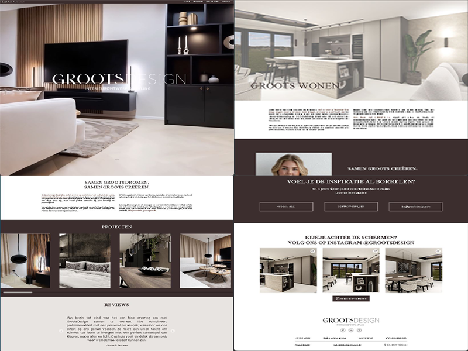

# Personal Portfolio Website



## Overview

This portfolio website showcases my projects, skills, and experience as a web developer. Built with modern technologies including React, Next.js, TypeScript, and TailwindCSS, this responsive portfolio highlights my work and technical capabilities in an interactive and visually appealing way.

## Features

- **Responsive Design**: Fully responsive layout that works on desktop, tablet, and mobile devices
- **Dark/Light Mode**: Theme toggle with system preference detection
- **Animated UI**: Smooth animations using Framer Motion
- **Project Showcase**: Featured projects with descriptions, technologies used, and links
- **Contact Section**: Easy ways to get in touch with me
- **About Section**: Information about my experience and background

## Tech Stack

- **Framework**: [Next.js](https://nextjs.org/)
- **Language**: [TypeScript](https://www.typescriptlang.org/)
- **Styling**: [TailwindCSS](https://tailwindcss.com/)
- **UI Components**: [shadcn/ui](https://ui.shadcn.com/)
- **Animations**: [Framer Motion](https://www.framer.com/motion/)
- **Icons**: [Lucide React](https://lucide.dev/)
- **Hosting**: [Vercel](https://vercel.com/)

## Projects Featured

1. **Groots Design Site** - Custom React site for an Interior Design company
2. **Remembr Site** - Social media platform focused on memorializing loved ones
3. **PebblyPal** - iOS app for calorie counting and weight tracking
4. **Farming The Apocalypse** - Pixel art PC game with post-apocalyptic farming theme

## Getting Started

### Prerequisites

- Node.js (v16 or newer)
- npm or yarn

### Installation

1. Clone the repository:
   ```bash
   git clone https://github.com/your-username/portfolio.git
   cd portfolio
   ```

2. Install dependencies using legacy peer deps flag (to resolve dependency conflicts):
   ```bash
   npm install --legacy-peer-deps
   ```

3. Build the project:
   ```bash
   npm run build
   ```

4. Start the server:
   ```bash
   npm run start
   ```

5. Open your browser and visit:
   ```
   http://localhost:3000
   ```

## Development Mode

To run the project in development mode with hot reloading:

```bash
npm run dev
```

## Deployment

This portfolio is deployed on Vercel. For your own deployment:

1. Push your repository to GitHub
2. Connect your repository to Vercel
3. Vercel will automatically build and deploy your site

## Contact

Feel free to reach out to me if you have any questions or would like to collaborate on a project:

- GitHub: [github.com/your-username](https://github.com/your-username)
- LinkedIn: [linkedin.com/in/your-profile](https://linkedin.com/in/your-profile)
- Email: your.email@example.com

## License

This project is open source and available under the [MIT License](LICENSE).

---

⭐️ From [Your Name]
